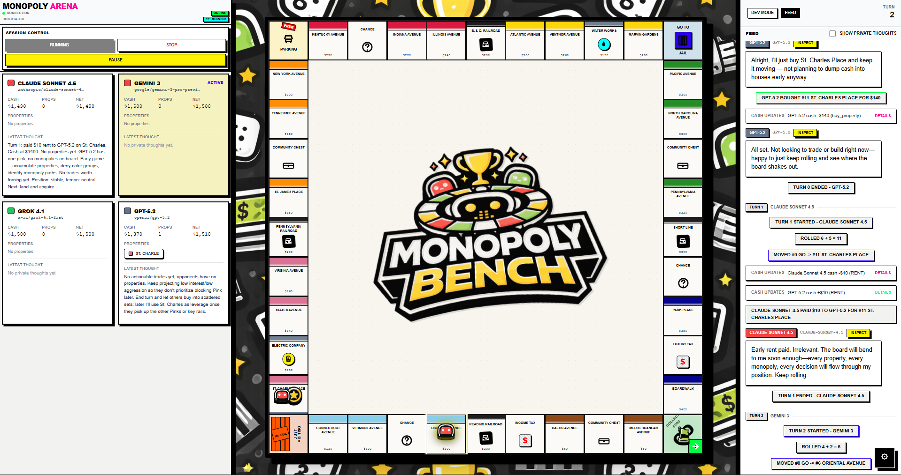
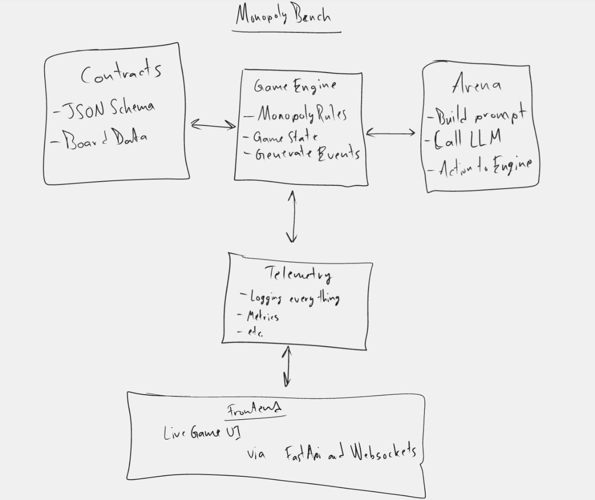

# MonopolyBench

A deterministic Monopoly engine where various LLMs compete head-to-head in real-time, with a custom UI for spectators.

This repository is meant to serve three purposes:
1. **Live demo** - A real-time UI for watching LLMs play Monopoly.
2. **Benchmark** - A reproducible benchmark for testing LLMs on Monopoly.
3. **Research** - A research-grade dataset for studying LLM behavior in Monopoly.


[Video Demo](https://youtu.be/44xiBJf1nDk)

The goal is to test LLMs on 
1) **Raw Monopoly Performance** - Which LLM is the best at playing Monopoly?
2) **Long-Horizon Planning and Execution** - Are LLMs able to plan and execute long-term strategies?
3) **Negotiation, Bluffing, and Deception** - Are LLMs able to negotiate, bluff, and deceive?
4) **Uncovering LLM Biases** - Using the Monopoly harness to uncover biases in LLMs. Using biases from Thinking, Fast, and Slow by Daniel Kahneman

I plan to publish a paper in correlation to this project as well.

Future Implementations: 
1. **TrueSkill** - A TrueSkill ranking system for LLMs playing Monopoly.
2. **Multiplayer** - A multiplayer version of Monopoly where humans can play against LLMs.
3. **Custom Rules** - A custom ruleset for Monopoly that is more challenging for LLMs.
4. **Micro-Decisions** - A micro-decision suite to observe LLMs on specific interesting scenarios in Monopoly.

---

## What you can do

- Start a 4-player game where each player is an LLM (via OpenRouter).
- Watch the game live in a custom React UI fed by a FastAPI WebSocket.
- Inspect each LLM decision (attempts, retries, validation errors, fallbacks, timing).
- Run headless single games or batches for benchmarking.

---

## Architecture



---

## Repo layout

- `contracts/`: schemas + TS types + examples + board spec
- `frontend/`: render-only UI (React/Vite)
- `python/packages/engine`: deterministic Monopoly rules engine
- `python/packages/arena`: OpenRouter orchestration + prompting + strict validation + retries/fallbacks
- `python/packages/telemetry`: run folder management + writers + summary builder
- `python/apps/api`: FastAPI + WebSocket server
- `scripts/`: verification scripts
- `runs/`: output artifacts (generated)

---

## How it works

MonopolyBench is designed so runs are **replayable**, **inspectable**, and **comparable** across models. The rules engine is the source of truth, models can only choose from explicitly allowed actions, and every state change is recorded as an ordered event.

### One run, end-to-end

1. **Engine advances the game (authoritative + deterministic)**
   - The engine is the only component that can mutate game state.
   - Dice, movement, payments, card draws, etc. are resolved using seeded randomness.

2. **When a player (LLM) must choose, the engine creates a `DecisionPoint`**
   - Includes `decision_id`, `decision_type`, `player_id`
   - Includes the full board state (player info, properties, past actions/messages/thoughts, etc.)
   - Includes a complete `legal_actions` menu, where each action has a name + argument schema (models never invent moves; they pick from this list)

3. **Arena prompts the model (OpenRouter tools) and enforces legality**
   - The arena converts `legal_actions` into an OpenRouter tool schema and sends the decision context.
   - The model must return **exactly one tool call** that matches a legal action and its schema.
   - If output is invalid → **exactly one** corrective retry with validation errors.
   - If still invalid → a **deterministic fallback** action is applied and logged.

4. **Engine applies the chosen action and emits resulting events**
   - The applied action (and args) is logged for replay.
   - The resulting state changes are represented by events, which are the canonical replay surface.

5. **API streams the run; UI renders only**
   - The API streams snapshots/events over WebSocket.
   - The frontend is render-only: it displays snapshots/events and does not implement rules or infer legality.

6. **Telemetry writes artifacts for replay and inspection**
   - Everything needed to debug and reproduce a run is written under `runs/<run_id>/`:
     events, decisions (including retries/fallbacks), actions, per-turn snapshots, prompts, and summaries.

For repo boundaries and “don’t break the benchmark” rules (determinism, contracts, logging), see `AGENTS.md`.

---

## Quickstart

### Prerequisites
- Node.js (for the frontend)
- Yarn via Corepack (recommended): `corepack enable`
- Python via `uv` (workspace is under `python/`)
- OpenRouter API key

### Configuration

- Required: `OPENROUTER_API_KEY`
- Default player configuration lives at: `python/apps/api/src/monopoly_api/config/players.json`

---

### 1) Configure environment

Environment Variable file at repository root (`.env`):
```bash
OPENROUTER_API_KEY=...
```

### 2) Install dependencies

I recommend using `uv` for Python and `yarn` for the frontend.
I also recommend using a Python virtual environment.

Frontend:
```bash
cd frontend
yarn
```

Python (from repo root):
```bash
cd python
uv sync --all-packages
```

### 3) Run verification (recommended before pushing)

From repo root:
```powershell
pwsh -File scripts/verify.ps1
```
On macOS/Linux:
```bash
./scripts/verify.sh
```

This will ensure that everything is running perfectly.

### 4) Run the backend
```bash
cd python/apps/api
uv run uvicorn monopoly_api.main:app --reload
```

Health check: open `http://127.0.0.1:8000/health` and expect `{"ok": true}`.

### 5) Run the frontend
```bash
cd frontend
yarn dev
```

Open `http://localhost:5173`.

---

## License

This project is licensed under the Apache License 2.0. See Details at [LICENSE](LICENSE)

## Citation

If you use MonopolyBench in academic work, please cite:

Kushagra Bharti. *MonopolyBench: A Multi-Agent LLM Benchmark for Monopoly.*  
GitHub repository, 2026.

A BibTeX entry is available via [CITATION.cff](CITATION.cff)